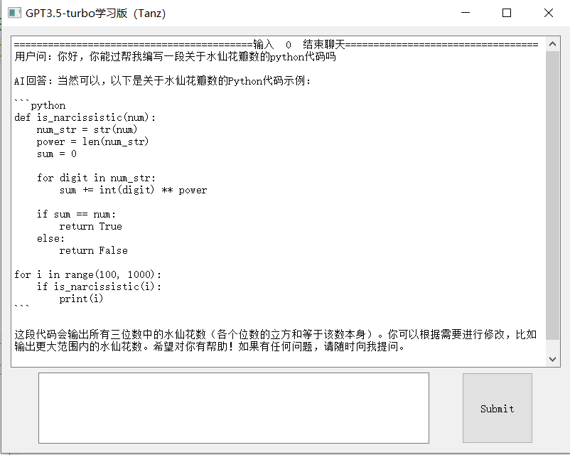
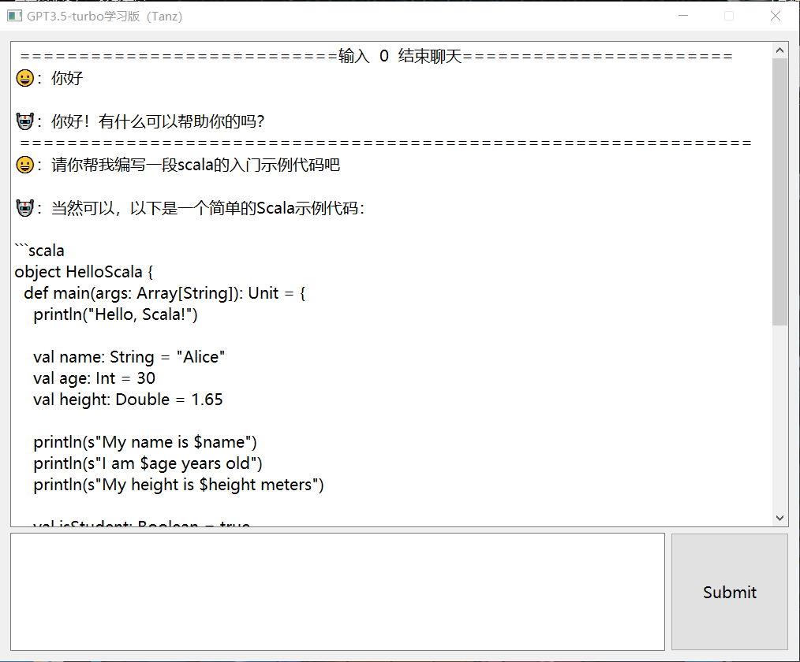

# Qt_GPT3
使用PyQt开发的ChatGPT 3 Api 接口接收极简版客户端，接口来源于https://github.com/chatanywhere/GPT_API_free

可以直接下载我已打包好的exe包，内置GPT3.5-turbo版本👇

[v2版本，推荐下载](https://github.com/QiPanTanYi/Qt_GPT3/releases/tag/v2)

[v1版本，样式较小](https://github.com/QiPanTanYi/Qt_GPT3/releases/tag/v1)

ps:只能在中国境内使用

<br>

注意事项：

```python
client = OpenAI(
    # defaults to os.environ.get("OPENAI_API_KEY")
    api_key=" ",
    base_url=" " 
)
```

代码块中的api_key和base_url需要手动填写。

采用pyinstaller打包为exe文件👇

```shell
pyinstaller --onefile --noconsole GPT3.5.py
```

最后可以在pyinstaller的dict中找到对应的exe文件。


<br>

演示效果：



<br>

更新：在v1版本基础上，增加了类似打字机的流式输出效果，UI界面变大，字体大小优化，用户使用表情区分，拒绝空请求。

